# Overview of [TP Final](tp_final.py)

The file [`tp_final.py`](tp_final.py) implements a complete digital communication system simulation. It leverages modular components from the `lib` directory, including modulation, channel modeling, demodulation, and visualization utilities. The main goal is to analyze system performance under various Phase-Locked Loop (PLL) parameters and Signal-to-Noise Ratio (SNR) conditions.

## Main Steps

1. **Parameter Initialization**
   - The script defines key simulation parameters such as symbol period (`Tsymb`), sampling period (`Ts`), sampling frequency (`fs_MHz`), and carrier frequency (`f0_MHz`).
   - Arrays for PLL proportional (`pll_kp_array`) and integral (`pll_ki_array`) gains, SNR values (`snr_dB_array`), and the number of simulation iterations are set up.

2. **Component Instantiation**
   - **Channel:** An instance of [`Channel`](lib/channel/channel.py) is created, which can simulate either an ideal (delta) or FIR low-pass channel, and adds AWGN noise according to the selected SNR.
   - **Modulator:** An instance of [`Modulator`](lib/modulator/modulator.py) is created, which handles packet creation (including preamble and SFD) and pulse shaping using a specified pulse type.
   - **Demodulator:** An instance of [`Demodulator`](lib/demodulator/demodulator.py) is created, which performs matched filtering, detection, and symbol synchronization using a PLL.

3. **Packet Generation and Modulation**
   - For each transmission (`N_TX`), a sequence of bytes is generated, modulated using the [`Modulator`](lib/modulator/modulator.py), and concatenated with synchronization zeros. The modulated signals and reference data are stored for later use.

4. **Simulation Loop**
   - The main simulation loop iterates over all combinations of SNR, PLL parameters, and iterations.
   - For each configuration:
     - The modulated signal is transmitted through the channel (with the current SNR).
     - The received signal is demodulated using the current PLL parameters.
     - The number of bit and byte errors is computed by comparing the demodulated output to the original data.
     - The error percentage is accumulated for statistical analysis.

5. **Visualization (Optional)**
   - If the `--display` flag is set and a specific PLL configuration is selected, the script uses the [`Plotter`](lib/plotter/plotter.py) class to visualize:
     - The original modulated signal
     - The signal after the channel
     - The output of the matched filter
     - The received bytes and bits compared to the transmitted ones

6. **Performance Analysis**
   - After all iterations, the script computes the average error rates for each PLL and SNR configuration.
   - It identifies the best PLL parameter combination (lowest average error).
   - Heatmaps are generated to visualize the error rates across the PLL parameter grid for each SNR value.

## Modular Design

- **Modulator ([`modulator.py`](lib/modulator/modulator.py)):** Handles all aspects of digital modulation, including packet formatting and pulse shaping.
- **Channel ([`channel.py`](lib/channel/channel.py)):** Simulates channel effects, including filtering and AWGN.
- **Demodulator ([`demodulator.py`](lib/demodulator/demodulator.py)):** Recovers transmitted data using matched filtering and PLL-based synchronization.
- **Plotter ([`plotter.py`](lib/plotter/plotter.py)):** Provides flexible visualization tools for real and complex signals at various processing stages.

## Purpose

This script is intended for educational and research purposes, allowing users to:
- Experiment with different PLL and channel parameters
- Visualize the impact of noise and synchronization on digital communication
- Analyze system robustness and optimize receiver settings

---

**In summary:**  
[`tp_final.py`](tp_final.py) orchestrates a full digital communication chain simulation, using modular classes from [`lib`](lib) for each subsystem, and provides both quantitative and visual analysis of system performance under varying conditions.

---


## Results without Noise

### SNR = No SNR (Ideal Channel)

In this scenario, the channel introduces no noise at all (SNR is set to `None`). This represents the ideal case for a digital communication system, where the transmitted signal is received perfectly without any distortion or interference.

- The following images illustrate each stage of the transmission and reception process under ideal conditions:
  1. **Transmitted Signal:** The full modulated signal containing all transmitted packets. Since there is no noise, the signal maintains its original shape and amplitude.
  2. **Zoomed-In Signal:** A close-up view of a single byte transmission, clearly showing the structure of the preamble, start frame delimiter (SFD), and the data frame itself.
  3. **Received Bytes:** The demodulator output, showing that all transmitted bytes are recovered exactly as sent.
  4. **Received Bits:** The bit-level comparison, confirming that every bit is received correctly.

This result is expected, as the absence of noise allows the receiver to perfectly synchronize and decode the transmitted data, resulting in zero errors.
### Errors: 0, Len Diff: 0, Error : 0.00%
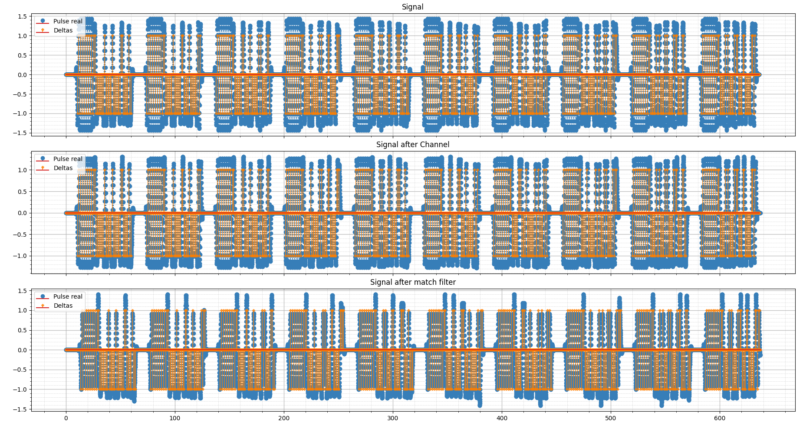
&nbsp;
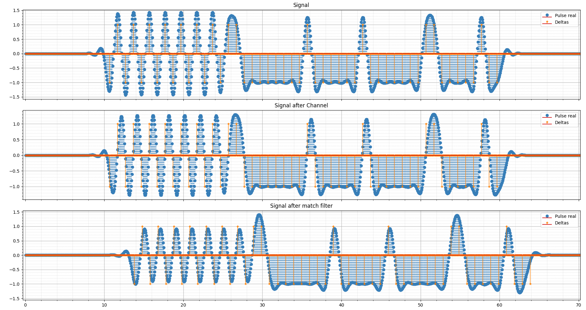
&nbsp;
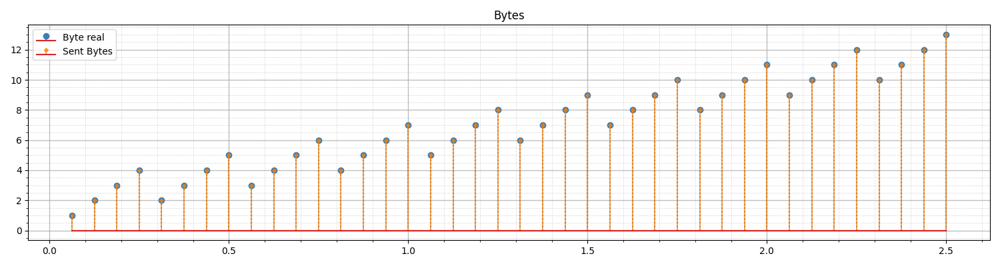
&nbsp;
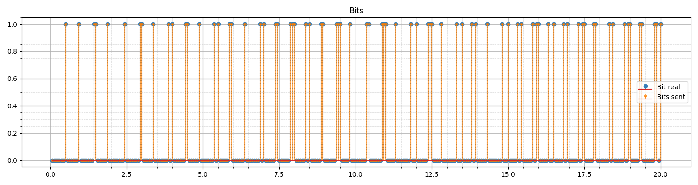

## Results with Noise added.

### SNR = 10 dB
#### An SNR (Signal-to-Noise Ratio) of 10 dB means that the signal power is 10 times greater than the noise power in the channel. 
Although some noise is present, it is low enough that the demodulator can correctly recover every transmitted byte without any errors. This demonstrates the robustness of the system under moderate noise conditions.

**Errors:** 0 **Length Difference:** 0 **Error Rate:** 0.00%

- The following images illustrate the signal at various stages of the transmission and reception process:
  1. **Transmitted Signal:** The complete modulated signal containing all transmitted packets.
  2. **Received Signal:** The signal after passing through the noisy channel.
  3. **Matched Filter Output:** The output of the matched filter, which helps maximize the signal-to-noise ratio at the receiver.
  4. **Received Data:** A comparison of the received bytes and bits with the originally transmitted data, showing perfect recovery.

### Errors: 0, Len Diff: 0, Error : 0.00%
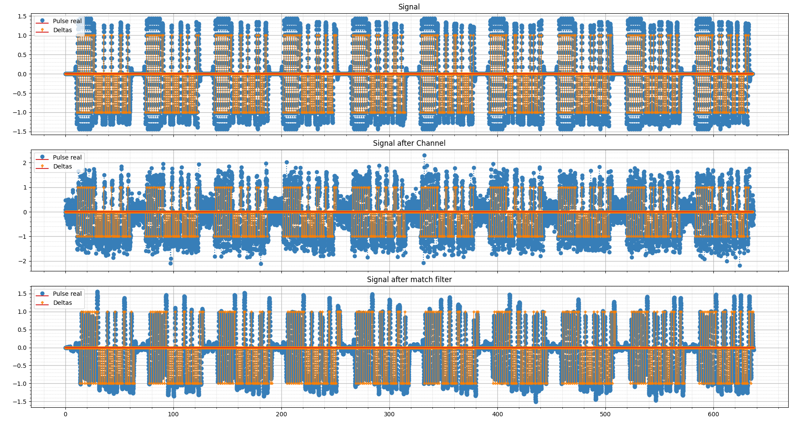
&nbsp;
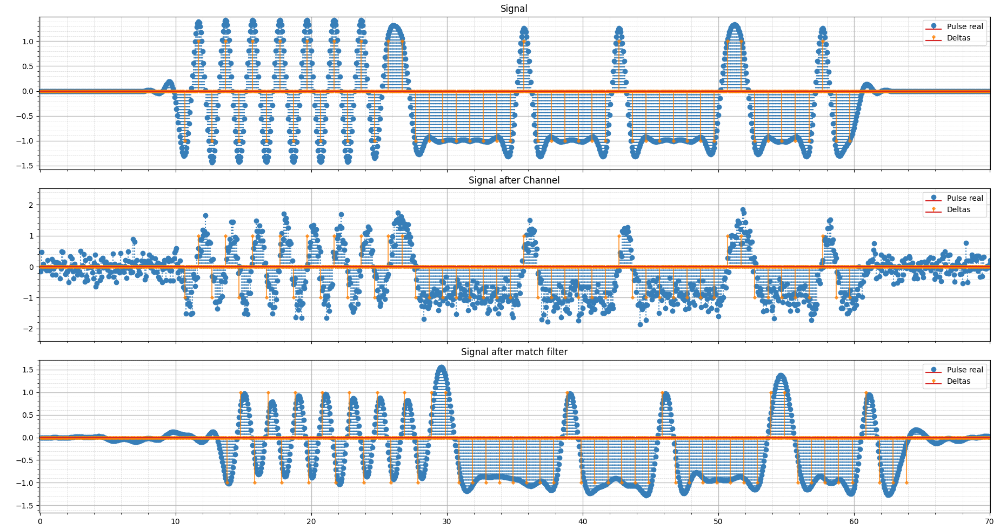
&nbsp;

&nbsp;


### SNR = 5 dB
#### With an SNR of 5 dB, the signal power is only about 3.16 times greater than the noise power. 
At this level, noise has a more significant impact on the transmission, and the demodulator starts to make errors in detecting the transmitted bytes and bits.


- The images below show increased distortion and errors in the received signal and data:
  1. **Transmitted Signal:** The original modulated signal.
  2. **Received Signal:** The signal after passing through a noisier channel.
  3. **Matched Filter Output:** The effect of noise is more visible, making symbol detection harder.
  4. **Received Data:** Several errors are present in the recovered bytes and bits compared to the transmitted data.

###Errors: 28, Len Diff: 4, Error Rate: 80.00%

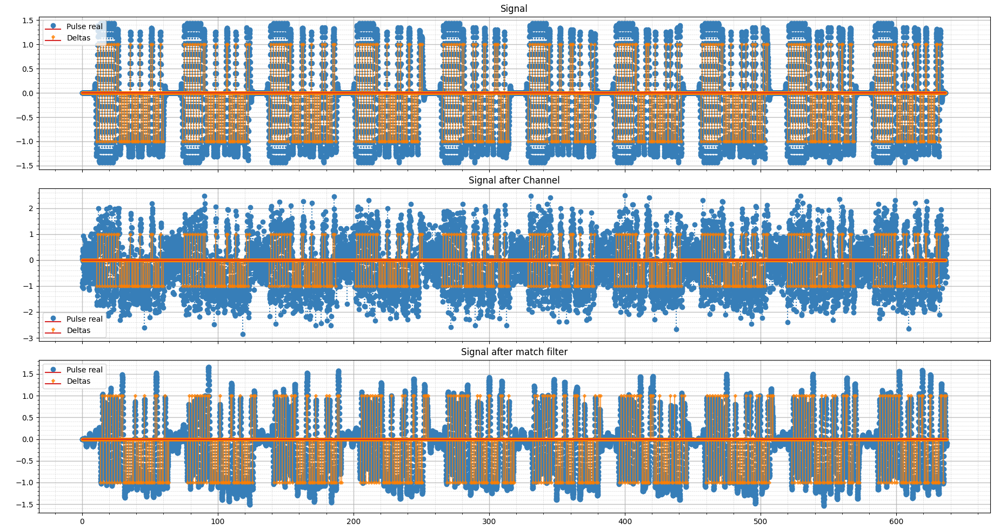
&nbsp;
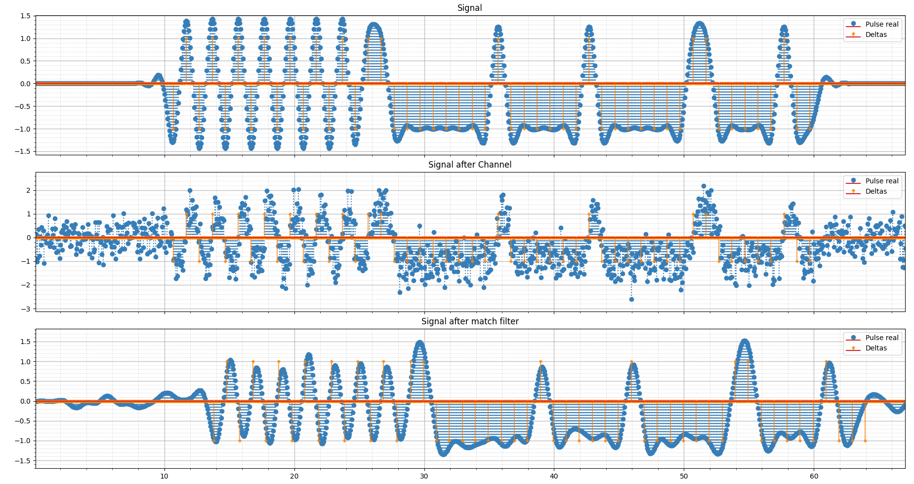
&nbsp;
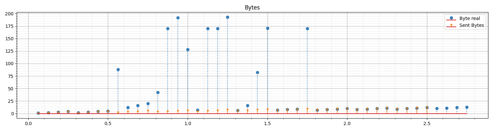
&nbsp;
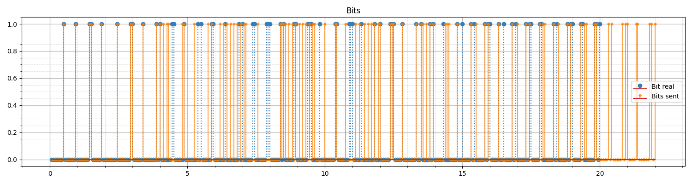

### SNR = 0 dB
#### An SNR of 0 dB means that the signal and noise powers are equal. 
This is a very challenging scenario for any communication system, as the noise can easily overwhelm the signal, leading to a high error rate.


- The following images show the severe impact of noise:
  1. **Transmitted Signal:** The original modulated signal.
  2. **Received Signal:** The signal is heavily corrupted by noise.
  3. **Matched Filter Output:** The output is dominated by noise, making reliable detection nearly impossible.
  4. **Received Data:** The recovered data contains many errors, demonstrating the limits of the system under extreme noise.

###Errors: 34, Len Diff: 2, Error Rate: 90.00%
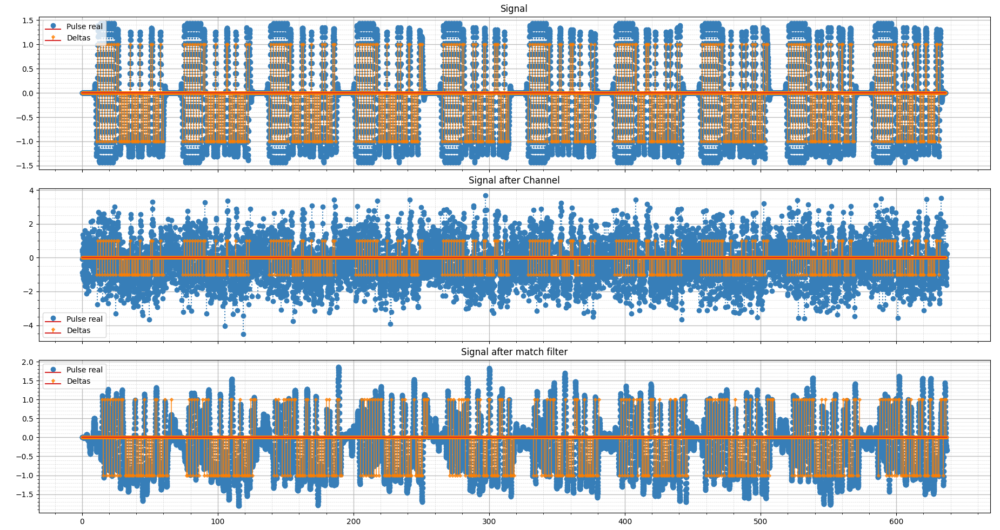
&nbsp;
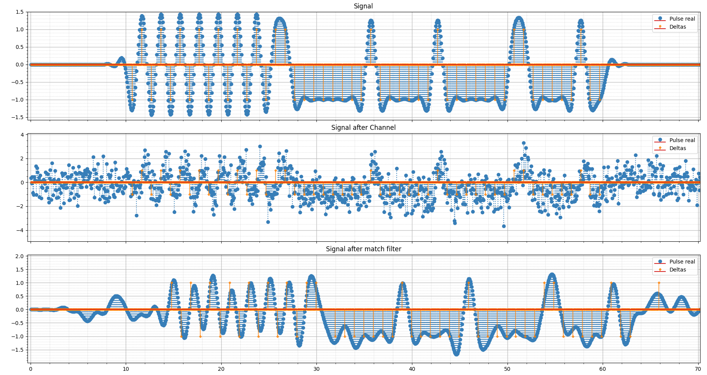
&nbsp;
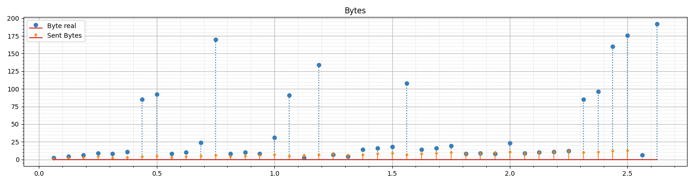
&nbsp;
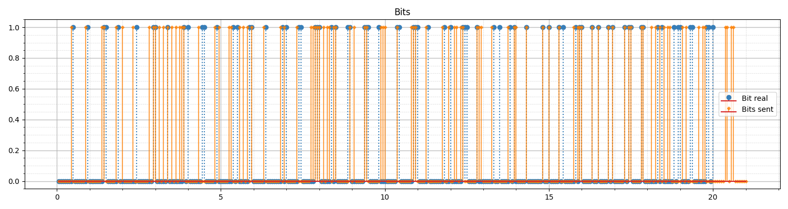


## Heatmap Analysis

The figure below presents a **heatmap** that summarizes the system's performance for different combinations of PLL parameters and SNR values:

### What does the heatmap show?

- The heatmap is divided into four subplots, each corresponding to a different SNR (Signal-to-Noise Ratio) scenario used in the simulation:  
  - **None (Ideal Channel)**: No noise is added to the signal.
  - **10 dB**: The signal power is 10 times greater than the noise power.
  - **5 dB**: The signal power is about 3.16 times greater than the noise power.
  - **0 dB**: The signal and noise powers are equal, representing a very challenging scenario.

- In each subplot:
  - The **horizontal axis** represents the values of **KP** (proportional gain) used in the PLL.
  - The **vertical axis** represents the values of **KI** (integral gain) used in the PLL.
  - The **color** at each point indicates the **average error rate** (percentage of incorrectly received bytes) for that specific KP/KI combination and SNR value.  
    - **Darker colors** indicate lower error rates (better performance).
    - **Lighter colors** indicate higher error rates (worse performance).

### How to interpret the four subplots?

- Each subplot allows you to visually compare how the system's robustness and sensitivity to PLL parameters change as the noise level increases.
- In the **ideal channel** (None), the system performs well for a wide range of KP and KI values.
- As the SNR decreases (more noise), the region of optimal KP/KI values shrinks, and the error rates increase, making the system more sensitive to parameter selection.
- This visualization helps identify which PLL parameter combinations are robust across different channel conditions.

### What are KP and KI?

- **KP (Proportional Gain):** Determines how strongly the PLL reacts to instantaneous phase errors. A higher KP can speed up the response but may cause instability if set too high.
- **KI (Integral Gain):** Allows the PLL to correct for accumulated phase errors over time. Increasing KI can help track slow phase changes but may also introduce overshoot or instability if too large.
- The optimal KP and KI values depend on the channel conditions and the system design.

### Best Global Combination

At the end of the simulation, the script automatically searches for the **best global combination** of KP and KI—that is, the pair that yields the lowest average error rate across all SNR values and iterations.

For example:
```
Best global combination KP = 0.45, KI = 0.00
```
This means that, for this particular simulation, a proportional gain of 0.45 and an integral gain of 0.00 provided the best overall performance.

---

**In summary:**  
The heatmap provides a powerful visual tool for analyzing how the choice of PLL parameters (KP and KI) affects the system's error rate under different noise conditions. It helps guide the tuning of the receiver for optimal data recovery and highlights the importance of robust parameter selection in digital communication systems.


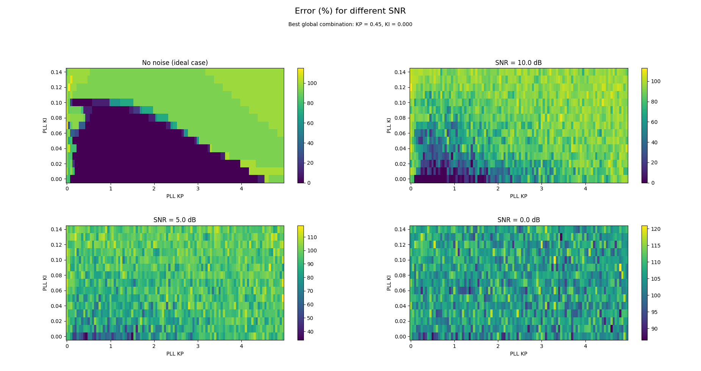

### Best global combination KP = 0.45, KI = 0.00
