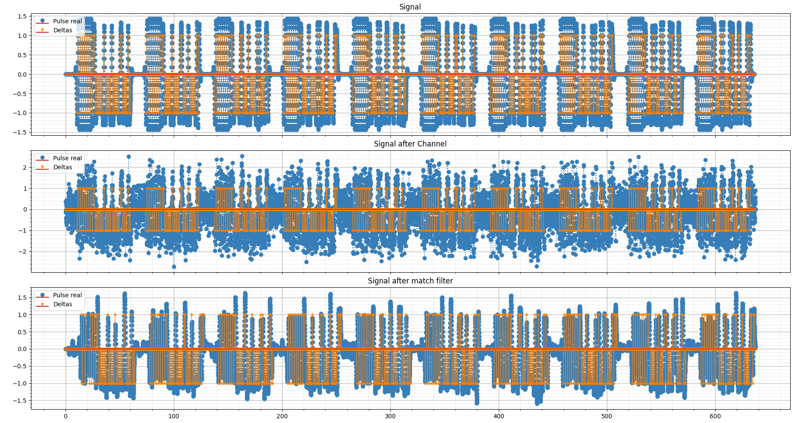

# Overview of [TP Final](tp_final.py)

The file [`tp_final.py`](tp_final.py) implements a complete digital communication system simulation. It leverages modular components from the `lib` directory, including modulation, channel modeling, demodulation, and visualization utilities. The main goal is to analyze system performance under various Phase-Locked Loop (PLL) parameters and Signal-to-Noise Ratio (SNR) conditions.

## Main Steps

1. **Parameter Initialization**
   - The script defines key simulation parameters such as symbol period (`Tsymb`), sampling period (`Ts`), sampling frequency (`fs_MHz`), and carrier frequency (`f0_MHz`).
   - Arrays for PLL proportional (`pll_kp_array`) and integral (`pll_ki_array`) gains, SNR values (`snr_dB_array`), and the number of simulation iterations are set up.

2. **Component Instantiation**
   - **Channel:** An instance of [`Channel`](lib/channel/channel.py) is created, which can simulate either an ideal (delta) or FIR low-pass channel, and adds AWGN noise according to the selected SNR.
   - **Modulator:** An instance of [`Modulator`](lib/modulator/modulator.py) is created, which handles packet creation (including preamble and SFD) and pulse shaping using a specified pulse type.
   - **Demodulator:** An instance of [`Demodulator`](lib/demodulator/demodulator.py) is created, which performs matched filtering, detection, and symbol synchronization using a PLL.

3. **Packet Generation and Modulation**
   - For each transmission (`N_TX`), a sequence of bytes is generated, modulated using the [`Modulator`](lib/modulator/modulator.py), and concatenated with synchronization zeros. The modulated signals and reference data are stored for later use.

4. **Simulation Loop**
   - The main simulation loop iterates over all combinations of SNR, PLL parameters, and iterations.
   - For each configuration:
     - The modulated signal is transmitted through the channel (with the current SNR).
     - The received signal is demodulated using the current PLL parameters.
     - The number of bit and byte errors is computed by comparing the demodulated output to the original data.
     - The error percentage is accumulated for statistical analysis.

5. **Visualization (Optional)**
   - If the `--display` flag is set and a specific PLL configuration is selected, the script uses the [`Plotter`](lib/plotter/plotter.py) class to visualize:
     - The original modulated signal
     - The signal after the channel
     - The output of the matched filter
     - The received bytes and bits compared to the transmitted ones

6. **Performance Analysis**
   - After all iterations, the script computes the average error rates for each PLL and SNR configuration.
   - It identifies the best PLL parameter combination (lowest average error).
   - Heatmaps are generated to visualize the error rates across the PLL parameter grid for each SNR value.

## Modular Design

- **Modulator ([`modulator.py`](lib/modulator/modulator.py)):** Handles all aspects of digital modulation, including packet formatting and pulse shaping.
- **Channel ([`channel.py`](lib/channel/channel.py)):** Simulates channel effects, including filtering and AWGN.
- **Demodulator ([`demodulator.py`](lib/demodulator/demodulator.py)):** Recovers transmitted data using matched filtering and PLL-based synchronization.
- **Plotter ([`plotter.py`](lib/plotter/plotter.py)):** Provides flexible visualization tools for real and complex signals at various processing stages.

## Purpose

This script is intended for educational and research purposes, allowing users to:
- Experiment with different PLL and channel parameters
- Visualize the impact of noise and synchronization on digital communication
- Analyze system robustness and optimize receiver settings

---

**In summary:**  
[`tp_final.py`](tp_final.py) orchestrates a full digital communication chain simulation, using modular classes from [`lib`](lib) for each subsystem, and provides both quantitative and visual analysis of system performance under varying conditions.

---

## Results

### Errors: 0, Len Diff: 0, Error : 0.00%

&nbsp;

&nbsp;

&nbsp;

### Errors: 0, Len Diff: 0, Error : 0.00%

&nbsp;

&nbsp;

&nbsp;

### Errors: 28, Len Diff: 4, Error : 80.00%

&nbsp;

&nbsp;

&nbsp;

### Errors: 34, Len Diff: 2, Error : 90.00%

&nbsp;

&nbsp;

&nbsp;

### Errors: 0, Len Diff: 0, Error : 0.00%

&nbsp;

&nbsp;

&nbsp;

### Errors: 0, Len Diff: 0, Error : 0.00%

&nbsp;

&nbsp;

&nbsp;

### Errors: 11, Len Diff: 2, Error : 32.50%

&nbsp;

&nbsp;

&nbsp;

### Errors: 34, Len Diff: 2, Error : 90.00%

&nbsp;

&nbsp;

&nbsp;

### Errors: 0, Len Diff: 0, Error : 0.00%

&nbsp;

&nbsp;

&nbsp;

### Errors: 1, Len Diff: 0, Error : 2.50%

&nbsp;

&nbsp;

&nbsp;

### Errors: 20, Len Diff: 2, Error : 55.00%

&nbsp;

&nbsp;

&nbsp;

### Errors: 40, Len Diff: 4, Error : 110.00%

&nbsp;

&nbsp;

&nbsp;

### Errors: 0, Len Diff: 0, Error : 0.00%

&nbsp;

&nbsp;

&nbsp;

### Errors: 0, Len Diff: 0, Error : 0.00%

&nbsp;

&nbsp;

&nbsp;

### Errors: 24, Len Diff: 4, Error : 70.00%

&nbsp;

&nbsp;

&nbsp;

### Errors: 22, Len Diff: 0, Error : 55.00%

&nbsp;

&nbsp;

&nbsp;

### Errors: 0, Len Diff: 0, Error : 0.00%

&nbsp;

&nbsp;

&nbsp;

### Errors: 0, Len Diff: 0, Error : 0.00%

&nbsp;

&nbsp;

&nbsp;

### Errors: 36, Len Diff: 6, Error : 105.00%

&nbsp;

&nbsp;

&nbsp;

### Errors: 33, Len Diff: 4, Error : 92.50%

&nbsp;

&nbsp;

&nbsp;

## Heatmap

### Best global combination KP = 0.45, KI = 0.00
