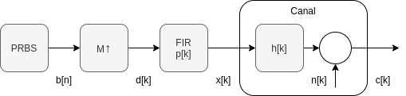
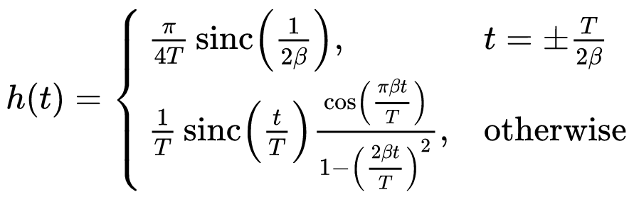
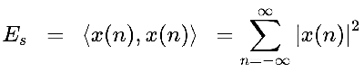

## Enunciado Trabajo Práctico 3

Simulación del modulador en banda base y el canal.

### Objetivo

Familiarizarse con las tareas que realiza el modulador de banda base y
con el modelo del canal y sus características.

### Descripción

Se tiene el siguiente sistema:

Considere un periodo de muestreo de $T_s = \frac{1}{16}\mu\text{s}$ y un
tiempo de símbolo $T_\text{symb}$ de 16 veces $T_s$.

1. Generar un script de *octave*, *python*, *matlab*, o cualquier otro lenguaje
    similar que implemente el sistema.
    - La señal `b` es una secuencia binaria aleatoria.
      Toma los valores `0` y `1` (o alternativamente `-1` y `1`);
    - La señal `d` inserta $M-1$ ceros entre cada bit y luego le asigna un
      `1.0` al bit `1` y un `-1.0` al bit `0` (o `-1`).
      Puede tomar los vaores `-1`, `0` o `1`.
    - El pulso `p` puede tener varias formas:
      1. Pulso cuadrado.
      2. Pulso triangular.
      3. Pulso seno.
      4. Pulso coseno elevado.

          

      Todos los pulsos deben tener un pico de altura 1.
    - La señal `x` es la señal a transmitir por el canal, se obtiene mediante
      la convolución entre `d` y `p`, o de manera equivalente realizando el
      filtrado de `d` mediante el filtro FIR de coeficientes `p`.
      En cualquier caso es importante descartar los primeros $\frac{L_p-1}{2}$
      valores, para que las señales `d` y `x` queden "sincronizadas".
    - El filtro `h` representa al canal y en este caso será un canal ideal, es
      decir, tendrá una única delta en 0.
    - La señal `n` representa a ruido blanco gaussiano aditivo (AWGN) del
      canal.
      Se lo caracterizará por su varianza: $\sigma^2 = N_0$
      (Modulación en banda base).

2. Graficar las señales `d`, `x` y `c` superpuestas en un mismo gráfico.
    Realice el gráfico para cada pulso del punto anterior.
    Verificar que las deltas coinciden con los picos de los pulsos, inclusive
    para el coseno elevado.
    Para este punto utilizar pocos datos para la secuencia binaria,
    no más de 20, para que se puedan observar bien los datalles de la señal
    generada.

3. Graficar la densidad espectral de las señales `x` y `c` del punto anterior
    en escala semilogaritmica.
    A diferencia del punto 1, dónde los pulsos tenían un pico de altura 1, para
    este caso se deben normalizar los pulsos para que tengan energía igual a 1.
    Para ello dividir al pulso por su energía utilizando la siguiente ecuación:

    

    Aclaración: Se debe notar que la señal que se transmite es una señal de
    tiempo continuo y por lo tanto, el cálculo del espectro deberíamos hacerlo
    en ese dominio y lo mismo con el cálculo de la energía.
    Además se debería considerar el tipo de interpolación del DAC.
    En este ejercicio estamos haciendo una aproximación del espectro y de la
    energía del pulso, a partir de la versión muestreada.

    Para el calculo de espectro utilizar de 1000 a 10000 datos para la
    secuencia binaria, para que que la aproximación tenga mejor
    resolución.

4. Suba el script a la carpeta de entrega.

5. Complete el archivo `README.md` con los gráficos del punto 2 y 3.

### Entrega

El script de simulación se debe agregar al repositorio, en la carpeta de
entrega correspondiente.

Asimismo, en la misma carpeta, se debe agregar un archivo `README.md` que
contenga las capturas de la simulación y una breve explicación de lo que se
está mostrando en cada caso.
Este archivo debe contener las instrucciones para ejecutar el script.

