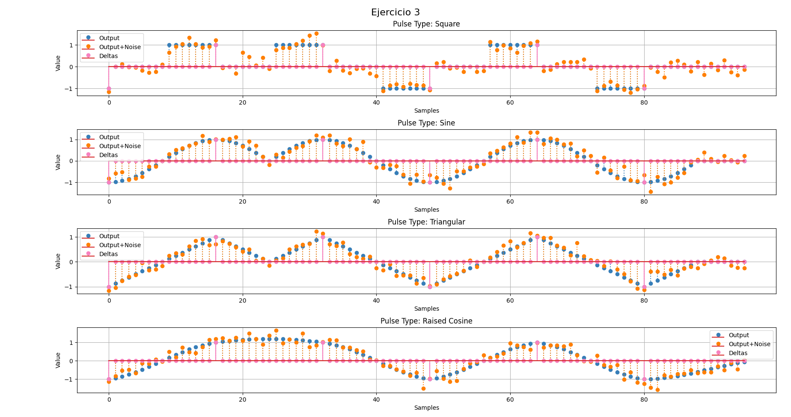
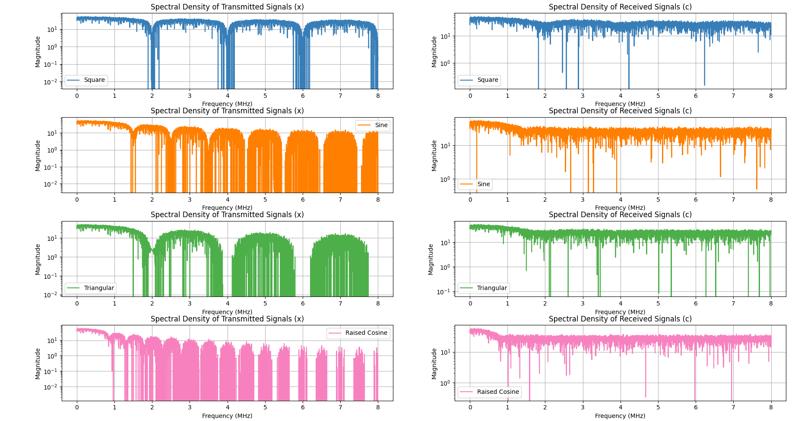

# Simulación del Modulador en Banda Base y el Canal

En este trabajo práctico se simula el sistema de modulación en banda base y el canal correspondiente. El objetivo es familiarizarse con las tareas que realiza el modulador de banda base y el modelo del canal, así como también comprender sus características.

## Descripción del Sistema

El sistema simulado consta de una secuencia binaria aleatoria `b`, una señal `d` que inserta ceros entre cada bit y asigna valores de amplitud (-1, 1), diferentes tipos de pulsos `p`, un filtro FIR representando al canal `h`, y ruido blanco gaussiano aditivo `n`.

## Objetivos

1. Implementación del sistema y generación de señales.
2. Gráfico de las señales `d`, `x` y `c` superpuestas para cada tipo de pulso.
3. Graficar la densidad espectral de las señales `x` y `c`.
4. Entrega del script de simulación y archivo `README.md` con explicaciones y capturas de los gráficos.

## Ejecución del Script

Para ejecutar el script de simulación, sigue estos pasos:

1. Clona este repositorio en tu máquina local.
2. Navega hasta la carpeta `ejercicios/ej03/entrega`.
3. Ejecuta el script `modulador_en_banda_base_y_canal.py` utilizando Python:

```
python3 modulador_en_banda_base_y_canal.py
```
## Gráficos

### Gráfico de Señales Superpuestas



En este gráfico se muestran las señales `d`, `x` y `c` superpuestas para cada tipo de pulso. Se puede observar cómo coinciden las deltas con los picos de los pulsos, incluso para el coseno elevado.

### Densidad Espectral



En este gráfico se muestra la densidad espectral de las señales `x` y `c` en escala semilogarítmica. Las señales han sido normalizadas para tener energía igual a 1, y se ha calculado utilizando una aproximación muestreada del espectro.

## Dependencias

Asegúrate de tener instalado Python en tu sistema. Puedes descargar e instalar la última versión de Python desde [python.org](https://www.python.org/downloads/).

También necesitarás tener pip, el gestor de paquetes de Python, instalado. En la mayoría de los casos, pip viene incluido con la instalación de Python. Sin embargo, si necesitas instalarlo por separado, puedes seguir las instrucciones en la [documentación oficial de pip](https://pip.pypa.io/en/stable/installation/).

Además, este script utiliza los siguientes módulos de Python, que puedes instalar utilizando pip:

- NumPy: Una biblioteca para trabajar con arrays y matrices de manera eficiente. Puedes instalar NumPy con el siguiente comando:

```bash
pip install numpy
```
- Matplotlib: Una biblioteca para crear visualizaciones estáticas, animadas e interactivas en Python. Puedes instalar Matplotlib con el siguiente comando:

```bash
pip install matplotlib
```
- scipy: Una biblioteca que proporciona numerosas rutinas numéricas eficientes. Puedes instalar scipy con el siguiente comando:

```bash
pip install scipy
```
Una vez que hayas instalado Python, pip y los módulos necesarios, puedes ejecutar el script de simulación como se describe en la sección anterior.