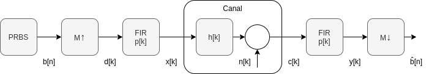

# Enunciado Trabajo Práctico 5

Se tiene el siguiente sistema:

Al igual que en el ejercicio 3 considere un periodo de muestreo de
$T_s = \frac{1}{16}\,\mu\text{s}$
y un tiempo de símbolo $T_\text{symb}$ de 8 o 16 veces $T_s$.

A diferencia del ejercicio 3, en este caso las señales `b`, `d`, `x`, `n`, `c`,
`y` y `^b` junto con `p` y `h` son complejas.
También se pueden pensar como señales con componentes I y Q.

1. Generar un script de *octave*, *pthon*, *matlab*, o cualquier otro lenguaje
  similar que implemente el sistema.

    - La señal `b` es una secuencia binaria aleatoria.
      Toma los valores `0` y `1`, o alternativamente `-1` y `1`.
    - La señal `d` inserta $M-1$ ceros entre cada bit y luego le asigna un
      `1` al bit `1` y un `-1` al bit `0`.
      Puede tomar los vaores `-1`, `0` o `1`.
    - El pulso `p` puede tener varias formas:
      1. Pulso cuadrado.
      2. Pulso triangular.
      3. Pulso seno.
      4. Pulso **raiz** de coseno elevado.
    - La señal `x` es la señal a transmitir por el canal, se obtiene mediante la
      convolución entre `d` y `p`, o realizando el filtrado mediante el filtro
      FIR.
      En cualquier caso es importante descartar los primeros $\frac{L_p-1}{2}$
      valores, para que las señales `d` y `x` queden "sincronizadas".
    - El filtro `h` es el equivalente de banda base del canal.
      Utilizaremos:
      1. Una delta de altura unitaria con fase igual a cero (canal ideal).
      2. Una delta de altura unitaria con fase distinta de cero.
      3. Un canal pasa bajos.

      Recordar eliminar los puntos que sean necesarios, para que las señales
      queden "sincronizadas".
    - La señal `n` representa a ruido blanco gausiano aditivo (AWGN) del canal.
      Se puede generar con muestras de una distribución normal con media cero.
      Para la varianza de la distribución, considerar la relación entre
      el error estándard y el nivel de ruido:
      $\sigma = \sqrt{N_0/2}$.

    - El filtro FIR del receptor debe estar escalado para que la amplitud máxima
      de la señal `y` (sin ruido) sea igual a 1.

    - La señal `^b` se obtiene quedándose por la muestra correcta de la señal
      `y`.

2. Para el pulso raiz de cosenos elevado elija una potencia de ruido y de
   manera similar al ejercicio 3, graficar las señales `d`, `c` e `y`
  (reemplazamos a `x` por `y`) superpuestas en un mismo gráfico.
  Realice el gráfico para cada pulso del punto anterior.
  Verificar que las deltas coinciden con los picos de los pulsos, inclusive
  para el coseno elevado.
  Realizarlo para el canal ideal.

3. Elija un pulso y dos potencias de ruido y para cada caso realizar un
  gráfico e las constelaciones.
  Incluir el símbolo sin ruido.
  Realizarlo para todos los canales.

4. Realizar un gráfico de MSE y BER vs la relación señal a ruido, para ello:
    1. Para las métricas considere:
       - MSE: Error cuadrático medio `mean((b-hat_b)^2)`.
       - BER: Bit-error rate `sum(b!=hat_b)/length(b)`.
    2. Hay que variar la potencia de ruido, dejando la potencia de señal fija.
    3. Calcular las energía y la potencia de la señal transmitida.
        Para esto considerar al pulso como una señal continua (no discreta),
        y calcular su energía como:

        $E_s = \int_{0}^{T_{\text{symb}}} |p(t)|^2 dt$

        y finalmente obtener la potencia diviendo por el período
        $P_s = E_s/T_{\text{symb}}$.
    4. La potencia de ruido es $P_n = \sigma^2 = N_0/2$.
    5. La relación señal a ruido es $SNR = P_s/P_n$.

5. Sientase libre de incluir cualquier otro gráfico que le parezca interesante.

6. Suba el script a la carpeta de entrega.

7. Complete el archivo `README.md` de la carpeta entrega con los gráficos,
    sus descripciones y la información que considere relevante.

