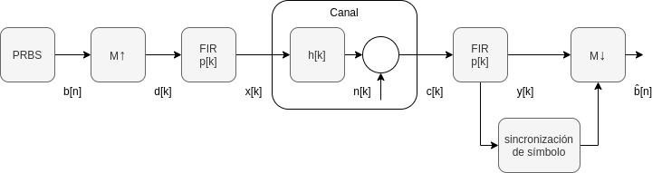

## Enunciado Trabajo Práctico 6

Simulación (demostrativa) del sistema completo incluyendo sincronización.

### Objetivo

Familiarizarse con las dificultades y las metodolosgías para la sincronización
de símbolo.

### Descripción

En este ejercicio se realiza una demostración de la simulación del sistema con:
- Modulador
- Canal
- Demodulador

A diferencia de los ejercicios 03 y 05, en este caso no se asume
que el demodulador está sincronizado y por lo tanto se debe implementar
el mecanismo de sincronización.

Se discuten los distintas dificultades involucradas en el proceso de
sincronización.

Se brindan los archivos de simulación para que los alumnos puedan reslizar
las simulaciones por su cuenta, realizar los gráficos y capturas que
crean necesarios.
Los alumnos son libres de analizar e investigar con mayor detalle el proceso
de sincronización.

### Entrega

La entrega se realiza directamente actualizando el archivo `README.md`
de la carpeta de la entrega.
Allí se deben incluir las distintas capturas de los gráficos y explicaciones
de lo discutido durante la demostración.

Los alumnos son libres de incluir cualquier otro tipo de información que deseen.

