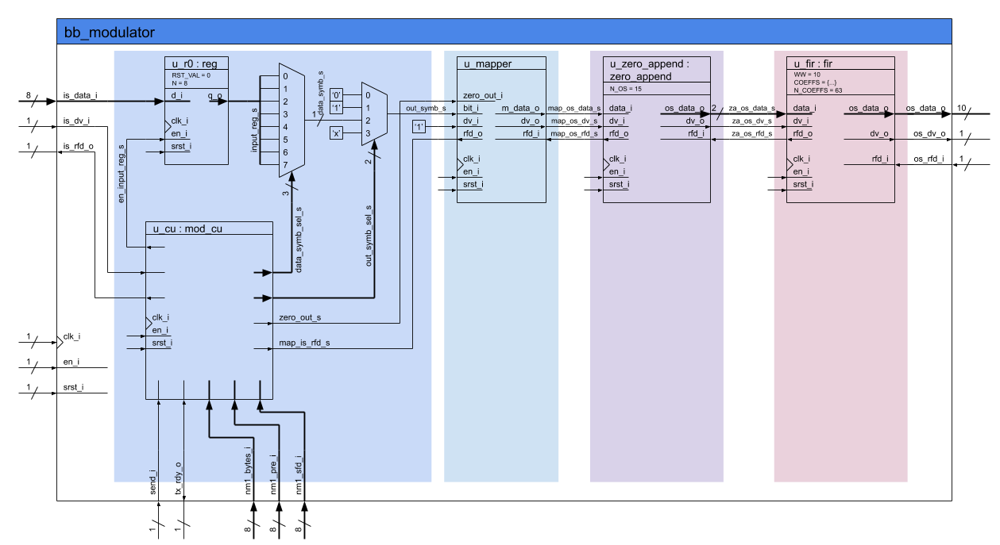

## Enunciado Trabajo Práctico 7

Simulación del RTL del modulador:

### Objetivo

Familiarizarse con la simulación en el repositorio y el bloque del
modulador.

### Diagramas en bloque



### Descripción

En este ejercicio se debe simular el modulador, para ellos:
1. Revisar estructura del respositorio en el archivo [README](../../README.md) 
    principal del repositorio.
2. En la carpeta `MSE-SDC-repo/modem/verification/tb_modulator/` encontrarán
    un testbench incompleto, en el cual falta instanciar el modulador.
    Se debe completar.
3. Finalmente se debe simular el modulador, para ello se puede utilizar:
    1. El software *GHDL* y *GTKWave*:
        Utilizar el `Makefile` ubicado en la carpeta
        `MSE-SDC-repo/modem/`.
        Para simular se puede utilizar:
        ```$ tb_bb_modulator```
        Para visualizar las señales con *GTKWave*:
        ```$ gtkwave_tb_bb_modulator```
    2. El software *Vivado*:
        Para ello se debe crear un nuevo proyecto con el SW
        (por favor mantener el workspace fuera del repositorio).
        Luego agregar todos los archivos/carpetas de la carpeta `src` como
        archivos de simulación e implementación.
        Inluri el testbench como archivo de simulación únicamente.

        Finalmente realizar la simulación.
4. Se deben buscar y visualizar todas las señales de interés en la simulación:
    - Tren de deltas.
    - Señal de salidas del filtro FIR.
    - Las señales de control.

    Las señales de datos se deben mostrar en formato "analógico".


### Entrega

La entrega se realiza directamente actualizando el archivo `README.md`
de la carpeta de la entrega.
Allí se deben incluir las distintas capturas del visualizador y una breve
explicación sobre lo que se está mostrando.

Se debe guardar el archivo de configuración del visualizador `gtkw` o `wcfg`
(GTKWave o Vivado respectivamente) en la misma carpeta que el test, en este
caso en la carpeta `MSE-SDC-repo/modem/verification/tb_modulator/`, de manera
que sea simple volver a visualizar las señales de acuerdo a la configuración
utilizada por el alumno.

Los alumnos son libres de incluir cualquier otro tipo de información que deseen.

