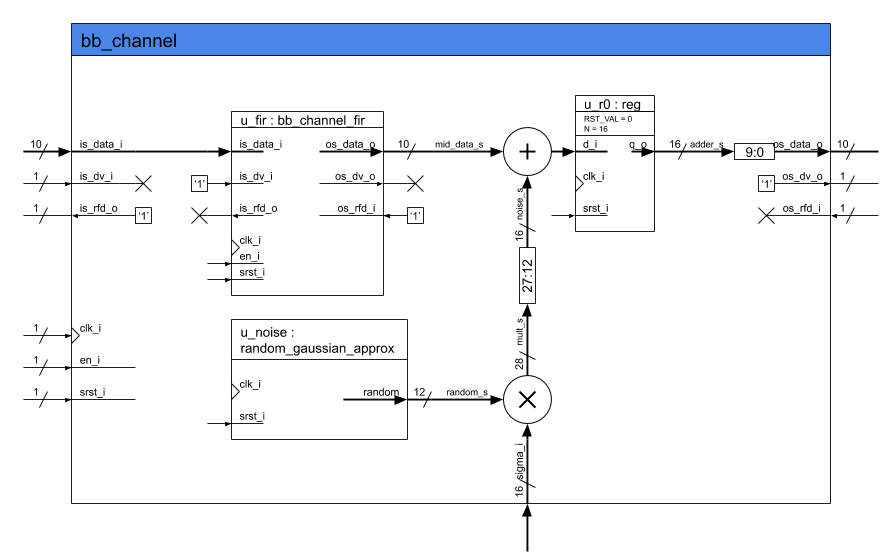
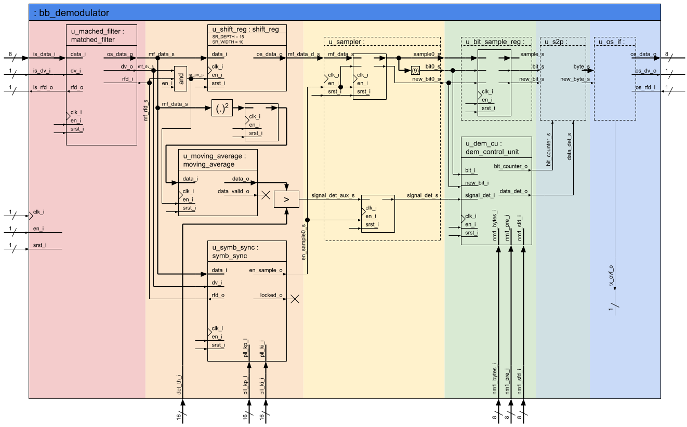
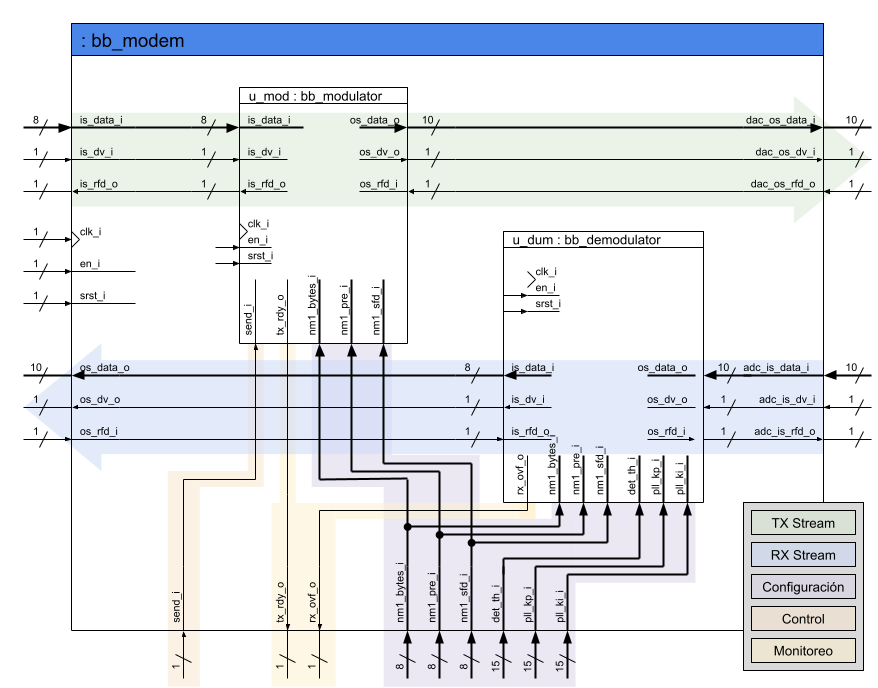

## Enunciado Trabajo Práctico 9

Simulación del código RTL del modem y el canal.

### Objetivo

Familiarizarse con bloque del demodulador y el bloque del modem
que incluye tanto al modulador como al demodulador.

### Diagramas en bloque

### Descripción

En este ejercicio se debe simular el modem junto con el canal, para ello:
1. Se debe crear un nuevo test en en el repositorio.
    Revisar el ejercicio anterior, en caso de no recordar cómo crear los test.
2. En el testbench se deben instanciar el modem junto con el canal.
3. Se debe simular el modulador y el canal.
    Revisar el ejercicio anterior en caso de no recordar cómo simular.
4. Se deben buscar y visualizar todas las señales de interés en la simulación:
    - Grupo 1:
      - Tren de deltas.
      - Señal de salidas del filtro FIR.
      - Señal de salida del canal.
      - Señal de salidas del filtro adaptado.
      - Señal subsampleada.
      - Señal de secuencia binaria estimada.
    - Grupo 2:
      - Las señales de control.
      - Las señales utilizadas para la sincronización.

    Las señales de datos se deben mostrar en formato "analógico".
    Opcionalmente se puede configurar al visualizador de señales para
    que respete la aritmética de cada una se las señales.

### Entrega

La entrega se realiza directamente actualizando el archivo `README.md`
de la carpeta de la entrega.
Allí se deben incluir las distintas capturas del visualizador y una breve
explicación sobre lo que se está mostrando en cada caso.

Se debe guardar el archivo de configuración del visualizador `gtkw` o `wcfg`
(GTKWave o Vivado respectivamente) en la misma carpeta que el test, en este
caso en la carpeta `MSE-SDC-repo/modem/verification/tb_test_modem_channel/`, de manera
que sea simple y rápido volver a visualizar las señales de acuerdo a la
configuración utilizada por el alumno.

Los alumnos son libres de incluir cualquier otro tipo de información que deseen.

